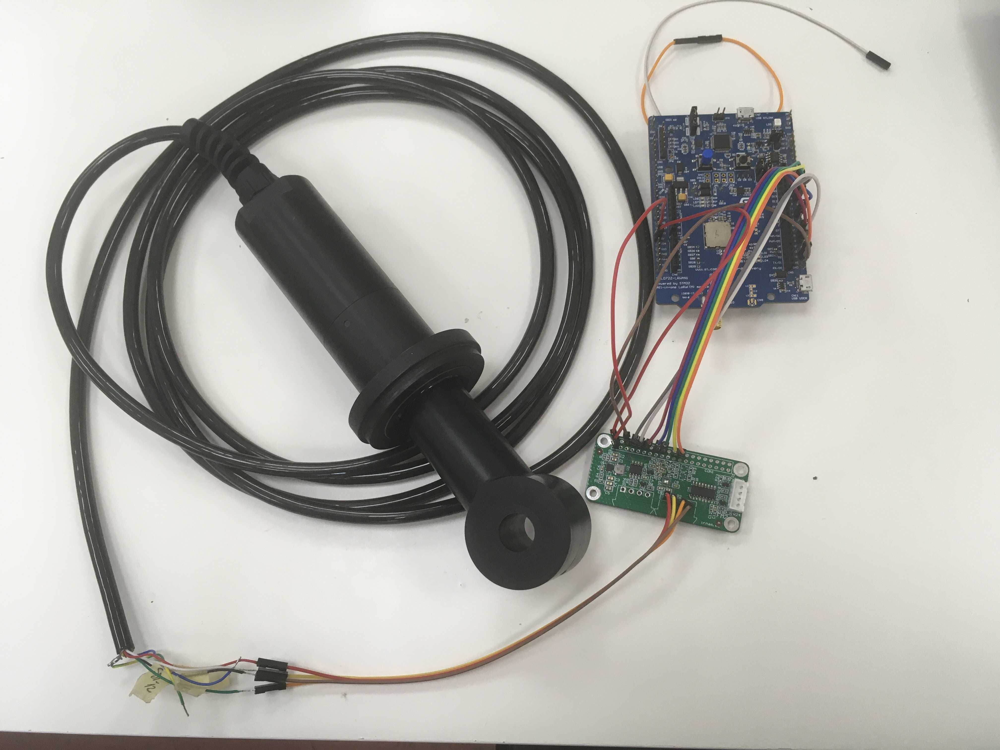
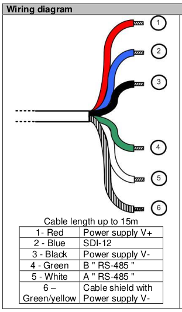
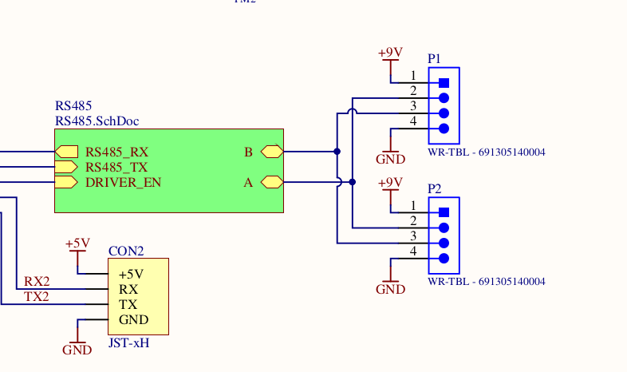

# Ifremer water monitoring

## Introduction

This repository contains all documentation and source code required to setup a Inductive Conductivity CTZN sensor (marked on sensor as SN-PCTZB).
Sensors product page can be found on manufacturers [website][product_page].
The source code was written to work on [B-L072Z-LRWAN1][lora_board], while using Arduino core.

All manufacturers documentation can be found in `ponsel_docs` folder and desktop application for measuring can be found in `ponsel_software` folder.

## Prerequisites
* B-L072Z-LRWAN1
* Pira Smart RS485 Add-On board, documentation about it can be found in `rs485_addon_hardware` folder
* CTZN sensor
* Arduino library for [Modbus protocol][arduino_library]

    
  <i>Required setup</i> 

[product_page]: https://en.aqualabo.fr/ctzn-digital-sensor-bare-wires-3-m-cable-stainless-steel-pipe-b4002.html
[lora_board]: https://www.st.com/en/evaluation-tools/b-l072z-lrwan1.html
[arduino_library]: https://github.com/4-20ma/ModbusMaster 

## Wiring

There are two different wiring setups that need to be taken care of.

### Connection between Ponsel sensor and Add-on board

  
    

