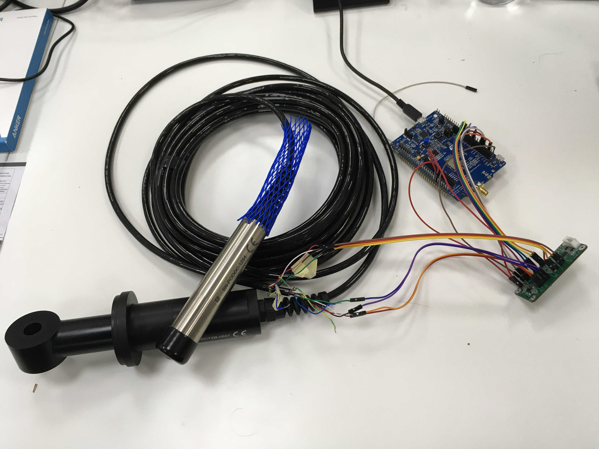

# Ifremer water monitoring

## Introduction

This repository contains all documentation and source code required to setup a Inductive Conductivity CTZN sensor (marked on sensor as SN-PCTZB).
Sensors product page can be found on manufacturers [website][product_page].
The source code was written to work on [B-L072Z-LRWAN1][lora_board], while using Arduino core.

All manufacturers documentation can be found in `ponsel_docs` folder and desktop application for measuring can be found in `ponsel_software` folder.

## Prerequisites
* B-L072Z-LRWAN1
* Pira Smart RS485 Add-On board, documentation about it can be found in `rs485_addon_hardware` folder
* CTZN sensor
* Arduino library for [Modbus protocol][arduino_library]

    
  <i>Required setup</i> 

[product_page]: https://en.aqualabo.fr/ctzn-digital-sensor-bare-wires-3-m-cable-stainless-steel-pipe-b4002.html
[lora_board]: https://www.st.com/en/evaluation-tools/b-l072z-lrwan1.html
[arduino_library]: https://github.com/4-20ma/ModbusMaster 

## Wiring

There are two different wiring setups that need to be taken care of.

### Connections between Ponsel sensor and Add-on board

As seen on image below Ponsel sensor has 6 wires, wires numbers 2 (blue) and 6 (green/yellow) are not needed.
Ponsel sensor has to be connected to one of two ports P1 or P2. Markings for Addon board can be seen on schematic below, there are also silkscreen markings on the bottom side of the board.

  <i>Wiring scheme of Ponsel sensor and Add-on board</i> 

### Connections between Add-on board and microcontroller

Connections are marked on image below, we need to provide following lines:
* 3.3V
* 5V
* GND
* TXD
* RXD
* GPIO18 (UART_SEL_B)
* GPIO23 (UART_SEL_A)
* GPIO24 (UART_INH)
* GPIO25 (DRIVER_EN)

**Important**: We actually do not need to switch UART lines when connection Add-on board to the microcontroller.
There is a mistake in naming in schematic and lines are already switched.
We therefore connect TX line from microcontroller to the TXD of Raspberry Pi header, same goes for RX and RXD.

    
  <i> Connections on Add-on board</i> 

